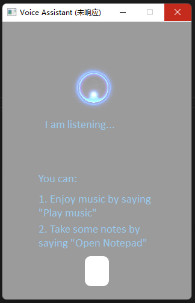
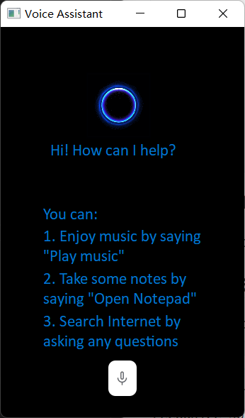
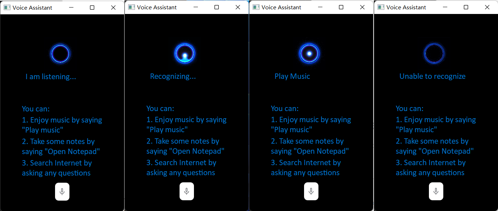

# Report

## Run the program

You can start the GUI by running `asr.py`

## Modifications to codes

### Add Windows API calls

The program implements the following functions:

- Play music

  Play `test.mp3` in the current directory if it exists. Otherwise show "Music not found" message on the GUI.

- Open a text file

  Open `note.txt` in the current directory if it exists. Otherwise create a new file named `note.txt` and then open it.

- Search the Internet

  If the user does not say the 2 commands above, the program will search on Bing (https://cn.bing.com) what the user speaks.

Since the accuracy of `recognize_sphinx` speech recognition API is not satisfactory, **partial matching** is used to improve recognition rate. For example, user should say "**Play music**" to activate the "Play music" function. In this program, however, the function will be executed **if the transcription contains** either "**play**" or "**music**". This can makes the program more **robust**, enabling it to work as expected even when some parts of the speech are mis-recognized.

```python
def execute_command(self, command):
    words = command.lower().split()
    if "play" in words or "music" in words:
        if os.path.exists('.\\test.mp3'):
            win32api.ShellExecute(0, 'open', '.\\test.mp3', '', '', 1)
        else:
            # music not exists, show message on GUI
            self.label.setText(QtCore.QCoreApplication.translate(
                "MainWindow", "Music not found"))
    elif "open" in words or "notepad" in words:
        if not os.path.exists('.\\note.txt'):
            # create new file
            f = open('.\\note.txt', 'x')
            f.close()
        win32api.ShellExecute(0, 'open', '.\\note.txt', '', '', 0)
    elif command != '':
        # search on Bing
        url = 'https://cn.bing.com/search?q=' + command
        win32api.ShellExecute(0, 'open', url, '', '', 1)
```

### Multi-threading

The process of speech recognition is time-consuming. Therefore, the function to recognize speech **should not be implemented in the main thread** (which is responsible for the UI) as it **makes the UI freeze** (does not respond). 



Multi-threading is introduced to solve this problem. The sub-thread is used for voice recording and speech recognition. The UI remains responsive when the sub-threading is handling voice recording or speech recognition. The results of speech recognition are passed from the sub-thread to the main thread using signals (in form of `dict`) by calling the `callback()` function of the main window.

```python
# recognize.py
class Recognize_Thread(QThread):

    signal = pyqtSignal(dict)

    def __init__(self) -> None:
        super(Recognize_Thread, self).__init__()
        self.recognizer = sr.Recognizer()
        self.microphone = sr.Microphone()
        
    def run(self):
        """Transcribe speech from recorded from `microphone`.

        Returns a dictionary with three keys:
        "success": a boolean indicating whether or not the API request was
                successful
        "error":   `None` if no error occured, otherwise a string containing
                an error message if the API could not be reached or
                speech was unrecognizable
        "transcription": `None` if speech could not be transcribed,
                otherwise a string containing the transcribed text
        """
        # adjust the recognizer sensitivity to ambient noise and record audio
        # from the microphone
        with self.microphone as source:
            self.recognizer.adjust_for_ambient_noise(source)
            audio = self.recognizer.listen(source)
        # set up the response object
        
        response = {
            "success": True,
            "error": None,
            "transcription": None
        }

        # try recognizing the speech in the recording
        # if a RequestError or UnknownValueError exception is caught,
        #     update the response object accordingly
        try:
            response["transcription"] = self.recognizer.recognize_sphinx(audio)
        except sr.RequestError:
            # API was unreachable or unresponsive
            response["success"] = False
            response["error"] = "API unavailable"
        except sr.UnknownValueError:
            # speech was unintelligible
            response["error"] = "Unable to recognize speech"

        self.signal.emit(response)
```

```python
# asrinterface.py
class Ui_MainWindow(object):
    # ... (other functions)
    
    def callback(self, response):
        _translate = QtCore.QCoreApplication.translate
        print(response)
        if response["success"] is None:
            self.label.setText(_translate("MainWindow", "Recognizing..."))
            self.label.repaint()
        elif response["success"] and response["error"] is None:
            self.label.setText(_translate(
                "MainWindow", response["transcription"].title()))
            self.label.repaint()
            self.execute_command(response["transcription"])
        else:
            self.label.setText(_translate("MainWindow", response["error"]))
            self.label.repaint()
```

### Modifications to GUI

A button is added to start the recording. 



When recording, the UI shows "I am listening". When recognition finishes, the transcription will be shown on the UI and the corresponding Windows command will be executed. If recognition fails (unable to connect API or unable to recognize the audio), error message will be displayed on the UI.




## Improve accuracy of speech recognition

The accuracy of `recognize_sphinx` speech recognition API is not satisfactory. The `speech_recognition` package in Python also provides other speech recognition APIs, which have higher recognition accuracy. I tested the `recognize_google` API, which uses the Google Speech Recognition API. It has a **significantly higher recognition accuracy** than the `recognize_sphinx` API. However, VPN is required to access this API in Chinese mainland. Other APIs, such as `recognize_bing`, require a `key`, so they can only be used after registering on the developer platforms.

If there are **only a few possible words** in the speech, we can specify the `keyword_entries` parameter to improve accuracy. When the `keyword_entries` is specified, the recognizer only looks for the words in `keyword_entries`.
